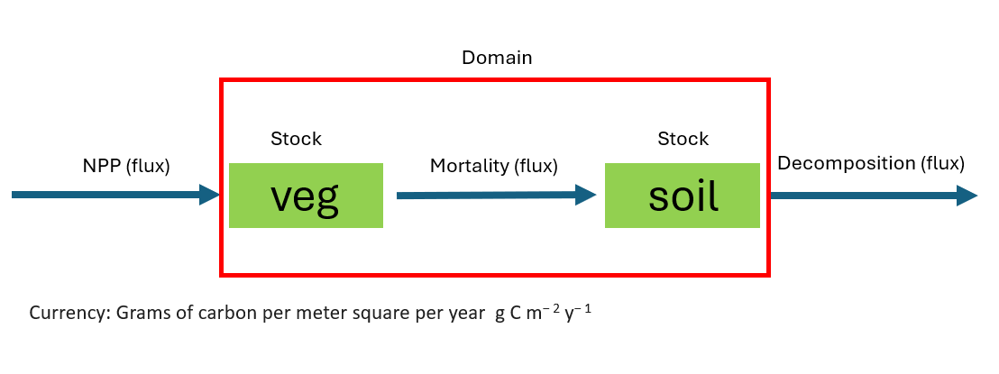

```{r setup, include=FALSE}
knitr::opts_chunk$set(echo = TRUE)
```
## Goals for lab

-	Describe the forest dynamics using a differential equation with source and sink terms
-	Build a simple soil decomposition model to explore exponential decay
-	Continue practicing R

## Part 1: Non-stochastic predictions

In the last two labs, you constructed a simple model of forest vegetation dynamics that predicted the growth and death of trees within a spatial domain. You also found that while the growth and death of individual trees were difficult to predict, the dynamics of the entire forest were much more predictable.  In this lab, you will build on the idea of macroscopic ecosystem behavior to construct an even simpler model.

**Question 1:** 

What are the inputs and outputs of the tree biomass stock in your forest model?  

**Answer 1:**

input is NPP and mortality is the output. 


You can describe the macroscopic behavior of the forest using a differential equation rather than needing to simulate the growth and random death of each individual tree.  A differential equation is an equation that describes the change in a ‘stock’ over time (think about a derivative that you learned in calculus).  The source and sink terms are biomass transfers into or out of the stock.  There can be as many source or sink terms as appropriate for the system you are modeling.  

$$\frac{dB}{dt} = source - sink$$
or

$$\frac{dB}{dt} = inputs - outputs$$

where dB is the change in vegetation biomass (gC m-2 yr-1) at time t and `dt` is the change in time (in Lab 1 and 2 dt = 1 year).

Using these ideas, you can develop a differential equation that describes the dynamics of the entire forest. The equation below includes the same NPP and mortality parameters that you used in Labs 1 and 2.

$$\frac{dB}{dt} = NPP - uB_t$$

which can be simulated in R using the following

```{r}
simulation_years <- 200  #total number of years you want to simulate
veg <- array(NA, dim = c(simulation_years))  #creating the array to store the yearly vegetation biomass

veg[1] <- 1  #initializing the vegetation biomass in year 1 to be 1

npp <- 300  #growth rate
u <- 0.02  #mortality rate

dt <- 1 #number of years for each time step

for(i in 2:simulation_years){
  #dBdt is the derivative (Change over the time-step)
  #It adds npp and substracts a proportion of biomass that died
  dBdt <- npp - veg[i-1] * u
  #add the change to the previous year's biomass
  #note: a positive number of dBdt will add biomass, while a negative value will subtract
  #note: since dBdt is the change per year, you need to multiply
  #      it by the number of years in a time step (which is 1)
  veg[i] <- veg[i-1] + dBdt * dt
}

year <- seq(1, simulation_years, 1)
plot(year, veg, type = 'l', xlab = 'years', ylab= 'Mean biomass (g m-2)')

```


**Question 2:** 

What is the difference between a stochastic and a deterministic process?  Is the differential equation above stochastic or deterministic?  Is the forest simulator from labs 1 and 2 stochastic or deterministic?  See Soetaert and Herman Chapter 3 Section 1.

**Answer 2:**
Stochastic is random, deterministic you can determine the result from the beginning based on the formula. You will get the same output if you run the same initial conditions. The forest simulator from lab 1 and 2 are stochastic. 

**Question 3:**  

How do the forest dynamics from the differential equation above compare to the dynamics of the 2x2 forest, 5x5 forest, and 50x50 forests you simulated in Lab 2?  You can visually compare your plots from Lab 2 and describe the differences in text.  

**Answer 3**
The growth of the in Lab 2 are stochastic (and we plotted multiple models to see generally what the range of outputs was).We got different final answers at equilibrium, though there was a more obvious trend the more individuals you added to the model. This differential equation gives you the same values and output every time if you use the same initial conditions. Also, there are no fluctuations at equilibrium when using differential equations (the way you do get those fluctuations at equilibrium when using the simulations we used at the beginning of the lab). 


**Question 4:**  

When do you think the differential equation approach to simulating ecosystem dynamics is appropriate rather than using a simulator that represents the growth and death of individual trees?

**Answer 4:**
when you are looking at a larger scale (in time) and modeling a larger ecosystem (with alot more individuals). When you aren't focused on modeling individuals but rather the ecosystem/community through a longer period of time. 


## Part 2: Simple decomposition model

Multiple differential equations can be solved simultaneously to model multiple stocks (or pools) in a forest ecosystem.  Above, you have already simulated the change in a single stock, vegetation biomass, over time (`dB/dt`).  We have simulated the following fluxes that we discussed in class: NPP and mortality.  

To simulate Net Ecosystem Production (NEP) and total carbon storage, we need to calculate heterotrophic respiration, which is the decomposition of dead organic matter.

The simplest models of decomposition use the concept of exponential decay.  Exponential decay is a proportional loss of a stock over time. For example, consider a single soil carbon pool (S):

$$\frac{dS}{dt} = -kS_t$$
where `k` is the proportion of soil carbon decomposed each year.  The negative is before the `kS` because it is a sink, and the source is 0 (example lacks an input). 

Using the same approach you used above to simulate the vegetation differential equation, simulate the dynamics of the soil carbon pool with an initial stock of 1000 g C m-2 and a k of 0.005 (per year).  Run the simulation for 1000 years.  Repeat with a k of 0.001.  

```{r}
simulation_years <- 1000  #total number of years you want to simulate
soil_1 <- array(NA, dim = c(simulation_years))  

soil_1[1] <- 1000  #initializing the vegetation biomass in year 1 to be 1

k <- 0.005  #decomposition (output)

dt <- 1 #number of years for each time step

for(i in 2:simulation_years){
  #dBdt is the derivative (Change over the time-step)
  #It adds npp and substracts a proportion of biomass that died
  dSdt <- soil_1[i-1] * (-k)
  #add the change to the previous year's biomass
  #note: a positive number of dBdt will add biomass, while a negative value will subtract
  #note: since dBdt is the change per year, you need to multiply
  #      it by the number of years in a time step (which is 1)
  soil_1[i] <- soil_1[i-1] + dSdt * dt
}

year <- seq(1, simulation_years, 1)
plot(year, soil_1, type = 'l', xlab = 'years', ylab= 'soil carbon pool (g m-2)')
```


```{r}
simulation_years <- 1000  #total number of years you want to simulate
soil_2 <- array(NA, dim = c(simulation_years))  

soil_2[1] <- 1000  #initializing the vegetation biomass in year 1 to be 1

k <- 0.001  #decomposition (output)

dt <- 1 #number of years for each time step

for(i in 2:simulation_years){
  #dBdt is the derivative (Change over the time-step)
  #It adds npp and substracts a proportion of biomass that died
  dSdt <- soil_2[i-1] * (-k)
  #add the change to the previous year's biomass
  #note: a positive number of dBdt will add biomass, while a negative value will subtract
  #note: since dBdt is the change per year, you need to multiply
  #      it by the number of years in a time step (which is 1)
  soil_2[i] <- soil_2[i-1] + dSdt * dt
}

year <- seq(1, simulation_years, 1)
plot(year, soil_1, type = 'l', xlab = 'years', ylab= 'soil carbon pool (g m-2)')
points(year, soil_2, type= 'l' , col = 'red')

```

**Question 5:**  

Describe and compare the dynamics of the soil carbon pool with a k of 0.005 and a k of 0.001. Your plot should have both lines on the same figure.  

**Answer 5:**

The k with a 0.005 decomposes faster and reaches equilibrium faster than the k of 0.001, which makes sense, because the decomposition rate is slower. 

**Question 6: **: 

What are the units of k?

**Answer 6:**
g C m-2 per year

The final step in building a simple forest ecosystem model that can predict total carbon storage is to combine the vegetation model and the soil carbon model.

$$\frac{dB}{dt} = NPP - uB_t$$
$$ \frac{dS}{dt} = uB_t -kS_t$$
You will notice that the output part of the vegetation equation (i.e., mortality) is the input to the soil carbon differential equation, which links the two equations.

**Question 7:** 

List all the names of the arrows in the FES textbook Figure 2.1 that are associated with the fluxes that we are modeling.  Remember that we are modeling NEP using our flux equations.

**Answer 7: **

NPP (NPP): primary producer biomass
mortality (u * Bt):death, exudation, litterfall, herbivory, dead organic matter
Decomposition (k * St): organic c export, decomposition

**Question 8:**  

Draw a conceptual diagram of the model with vegetation biomass and soil carbon.  Label the system's stocks, fluxes, and domain.  Define the model currency and time scale. 

To answer Question 8, create a box and arrow diagram in PowerPoint, save it as an image on your hard drive, and use the following code to insert your image into R markdown. 

**Answer 8:**


Use R to solve the set of differential equations using the same approach as above but with two stocks rather than only one.  Therefore, your model will have four lines of code within the for-loop that loops over time: 

- a line of code to calculate dBdt
- a line of code to calculate dSdt
- a line of code to add dBdt to the Veg previous stock
- a line to code to add dSdt the the previous soil stock. 

The key is determining how to calculate dBdt and dSdt—remember that the output flux in dBdt is the input flux to dSdt.

Tip: Your solution will only have one for-loop.  You will NOT have a different loop for vegetation and soil (this is a common mistake).


```{r}
#insert set of differential equations here that are contained in the for loop (see above)
simulation_years <- 1000  #total number of years you want to simulate
veg <- array(NA, dim = c(simulation_years))  #creating the array to store the yearly vegetation biomass
soil <- array(NA, dim = c(simulation_years))


veg[1] <- 0  #initializing the vegetation biomass in year 1 to be 1
soil[1] <- 0

npp <- 300  #growth rate
u <- 0.02  #mortality rate
k <- 0.005 #decomposition

dt <- 1 #number of years for each time step

for(i in 2:simulation_years){
  dBdt <- npp - veg[i-1] * u #growth of the tree
  veg[i] <- veg[i-1] + dBdt * dt
  dSdt <- veg[i-1]* u - soil[i-1] * k 
  soil[i] <- soil[i-1] + dSdt * dt
  
}

year <- seq(1, simulation_years, 1)
plot(year, veg, type = 'l', xlab = 'years', ylab= 'Mean biomass (g m-2)', ylim =c(0, 75000))
points(year, soil, type= 'l' , col = 'red')

equilibrium <- veg[1000]+soil[1000] #equilibrium carbon stock 


```

**Question 9:**  

What is the equilibrium carbon stock of the entire ecosystem (vegetation + soil) using the following parameter values: NPP = 300, u = 0.02, and k = 0.005; Initial vegetation = 0 and Initial soil = 0)?

**Answer 9:**
0.005

**Question 10:** 

What is the change in vegetation carbon (dB/dt) and change in soil carbon (dS/dt) at equilibrium?

**Answer 10:** 

there is no change. 

## Part 3: Apply model

You are charged with finding a way to double the carbon stored in a forest ecosystem.  Using the model with vegetation and soils, find a parameter set (NPP, u, k) that results in a doubling of total carbon at equilibrium.  Find the parameters using trial and error (i.e., just play around with parameters and decide on a set).  Playing around with parameters helps build an intuition for how the model works.

```{r}
#insert set of differential equations here that are contained in the for loop (see above)
simulation_years <- 1000  #total number of years you want to simulate
veg <- array(NA, dim = c(simulation_years))  #creating the array to store the yearly vegetation biomass
soil <- array(NA, dim = c(simulation_years))


veg[1] <- 0  #initializing the vegetation biomass in year 1 to be 1
soil[1] <- 0

npp <- 600  #growth rate
u <- 0.02  #mortality rate
k <- 0.005 #decomposition

dt <- 1 #number of years for each time step

for(i in 2:simulation_years){
  dBdt <- npp - veg[i-1] * u #growth of the tree
  veg[i] <- veg[i-1] + dBdt * dt
  dSdt <- veg[i-1]* u - soil[i-1] * k 
  soil[i] <- soil[i-1] + dSdt * dt
  
}

year <- seq(1, simulation_years, 1)
plot(year, veg, type = 'l', xlab = 'years', ylab= 'Mean biomass (g m-2)', ylim =c(0, 150000))
points(year, soil, type= 'l' , col = 'red')

equilibrium <- veg[1000]+soil[1000] #equilibrium carbon stock 

```

**Question 11:** 

Provide a plot of time vs. total carbon stocks using your new parameters.

**Answer 11:**

```{r}
#insert set of differential equations here that are contained in the for loop (see above)
simulation_years <- 1000  #total number of years you want to simulate
veg <- array(NA, dim = c(simulation_years))  #creating the array to store the yearly vegetation biomass
soil <- array(NA, dim = c(simulation_years))
totalcarbon <- array(NA, dim= c(simulation_years))
veg[1] <- 0  #initializing the vegetation biomass in year 1 to be 1
soil[1] <- 0
totalcarbon[1] <- 0

npp <- 600  #growth rate
u <- 0.02  #mortality rate
k <- 0.005 #decomposition

dt <- 1 #number of years for each time step

for(i in 2:simulation_years){
  dBdt <- npp - veg[i-1] * u #growth of the tree
  veg[i] <- veg[i-1] + dBdt * dt
  dSdt <- veg[i-1]* u - soil[i-1] * k 
  soil[i] <- soil[i-1] + dSdt * dt
  totalcarbon[i] <- soil[i] + veg[i]
  
}

year <- seq(1, simulation_years, 1)
plot(year, totalcarbon, type = 'l', xlab = 'years', ylab= 'Total Carbon Stock (g m-2)', ylim =c(0, 150000))

equilibrium <- veg[1000]+soil[1000] #equilibrium carbon stock 

```

**Question 12:** 

How does your new set of parameters compare to the original set of parameters?

**Answer 12:**

I just doubled the NPP but kept everything else the same.

**Question 13:** 

The parameters that you changed are a simplified representation of actual ecosystem processes.  Mechanistically, how could you potentially manage or alter the processes in the ecosystem to result in the parameter changes that you used to double the carbon? 

**Answer 13:**

Plant more trees/take care to make sure the trees that are present are healthy and
put on more biomass!

**Question 14:** 

'...some models are useful'.  How did you find this modeling exercise useful?

**Answer 14:**

It was helpful in illustrating different fluxes in a carbon pool and how differential equations can be used
as a management tool to accomplish a goal. 